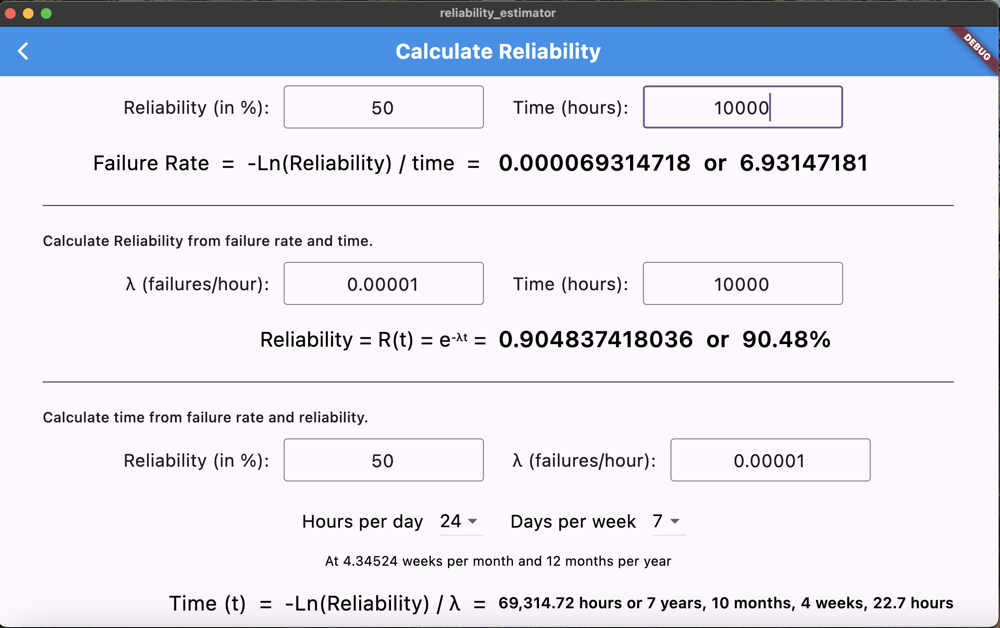
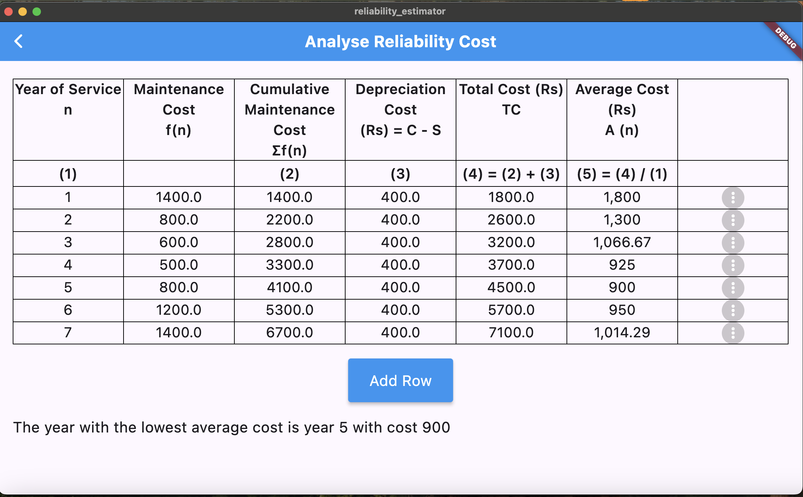

# reliability_estimator

An academic tool for calculating system reliability, failure rates, and optimal replacement timing.

## Description

Reliability Estimator is an academic application to calculate the reliability, failure rate, and Mean Time To Failure (MTTF) of a system under different initial conditions. It is designed for academic and industrial use.

## Purpose

The main purpose of the application is:
1. 🔍 Analyze key metrics: Reliability, Failure Rate, and MTTF.
2. ⏳ Predict the expected lifetime of equipment.
3. ⚙️ Optimize replacement schedules for cost-efficiency.
*Powered by advanced algorithms and a reactive Flutter UI*

## Screenshots

#### Reliability Calculation Screen

#### Optimum Lifetime Screen

## Contributing
We welcome contributions from anyone. To contribute to the project, please follow these steps:
- 🍴 Fork the repository.
- 🌿 Create a branch for your feature/fix.
- 💻 Commit changes with clear messages.
- 🔄 Push to your fork.
- ✨ Open a PR targeting the main branch.
